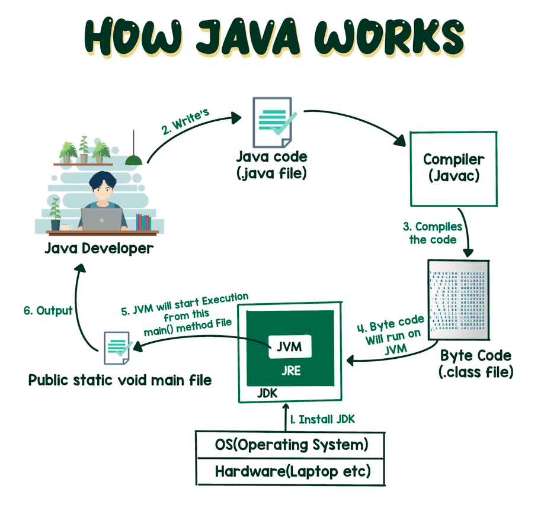

# Day01

## HellowWord的书写

简单的hellowword每次写总是会给我一种不一样的体验

## 学习的心得和想法

hellowword 对于自己来说，我是有学习过的，但是简单也很好
## 开班
Java2312，启航。

- 归零、坚持、合作
- 旅程、类比、生活
- 协助、制度、环境
- 自我介绍
    - ...
    - 没啥理想，活着就好
    - 没啥特长，腿毛特长
    - ...

## Hello World!
- 特有仪式
- 钢琴 🎹
- 手艺

## 小结
- 回顾、小结。
- 记录你的当天收获、灵感、想法...
- How Java Works
 