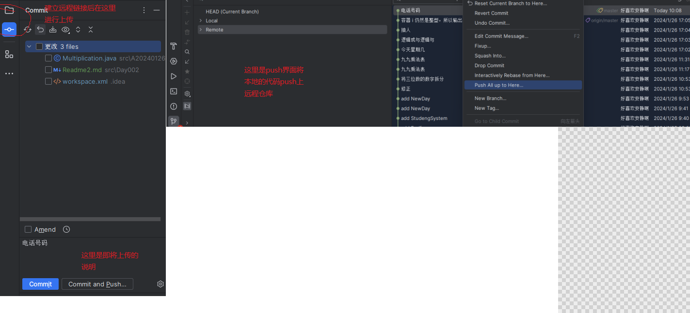

# 工具
getee 、 浏览器插件 、 Typora
## getee的使用
### 远程仓库的建立
下载getee后，建立远程仓库与idea上进行链接

### 远程仓库的上传

### getee的作用
可以防止代码丢失 、 上传代码从而知道自己的学习历程

## 浏览器翻译插件
沉浸式翻译插件：用来翻译网页

## 其他
Typora：用来进行书写解释内容

# 尾声
磨刀不误砍柴工，好的工具是今后路上所需要的