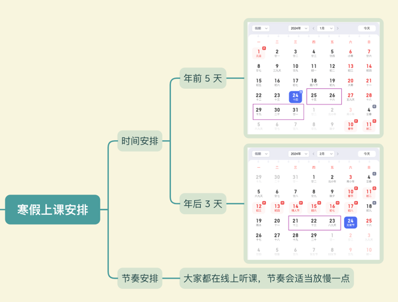
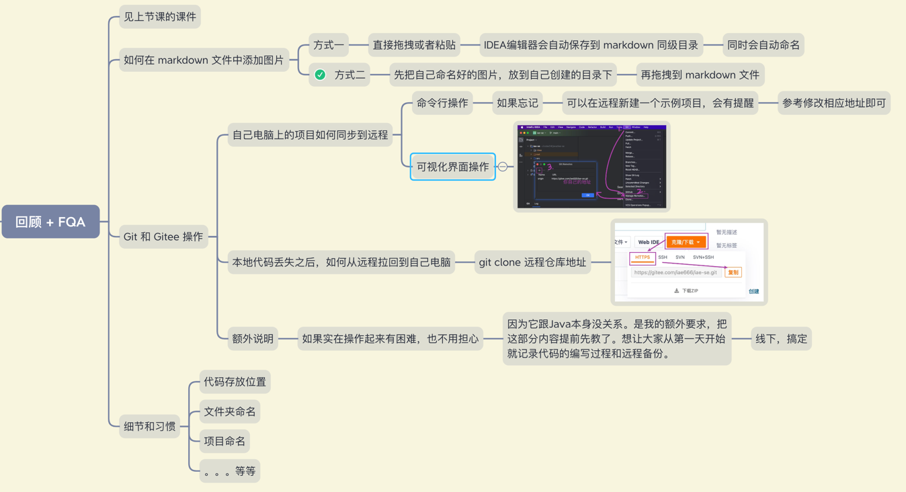
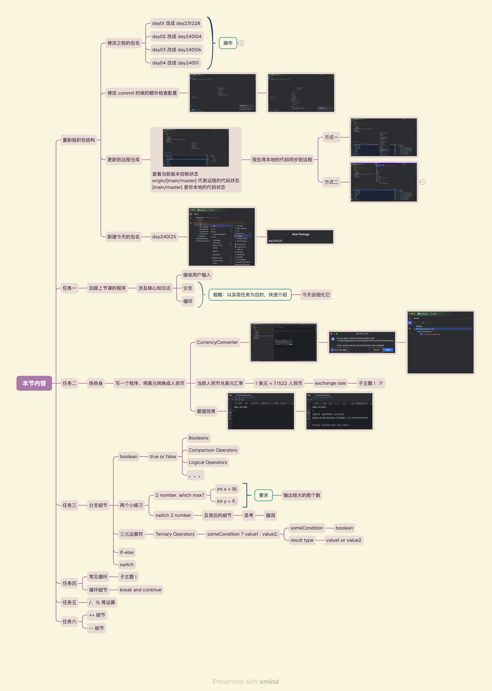

# 声明
将循环选择进行了复习和代码的演示，并且进入了练习进行加固学习

# 循环和选择

## 循环

循环是代码进行重复的动作的时候，让计算机去自动执行

## 选择

选择是利用计算机在对比后会产生一个布尔类型的结果，使其作为开关来进行下一步骤的方向

# 练习说明

## for if

在这个练习中掌握for和if的基本用法

## 月份计算

在这个练习中需要去选择想要知道的月份，然后循环之后得到天数

## 本节重点
- 借助简单的小例子，锻炼自己的思考能力，打开自己的脑洞
- 你不是在学习Java，而是在学习解决问题的能力
- 每一行代码的背后都能体现一个人的思考深度
- 注意细节和习惯
- 坚持

## 寒假上课安排
寒假课第一天，同步说明时间安排和节奏安排。

## 回顾 + FQA

## 本节内容

