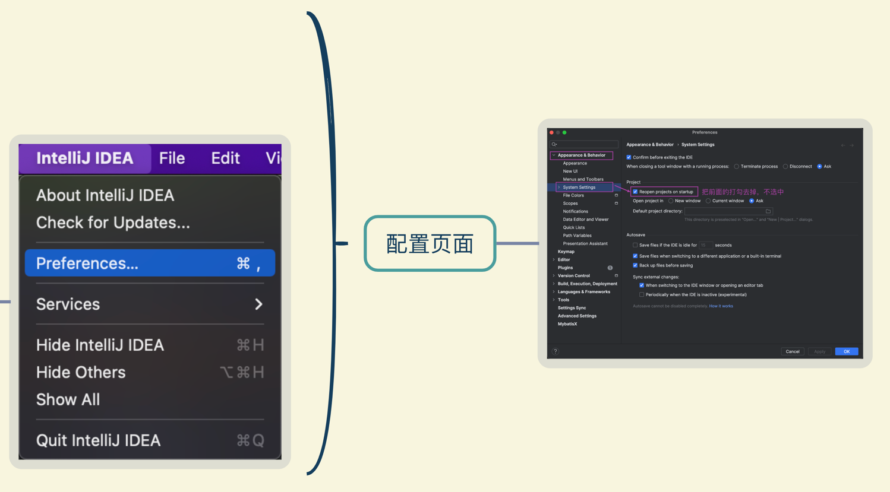
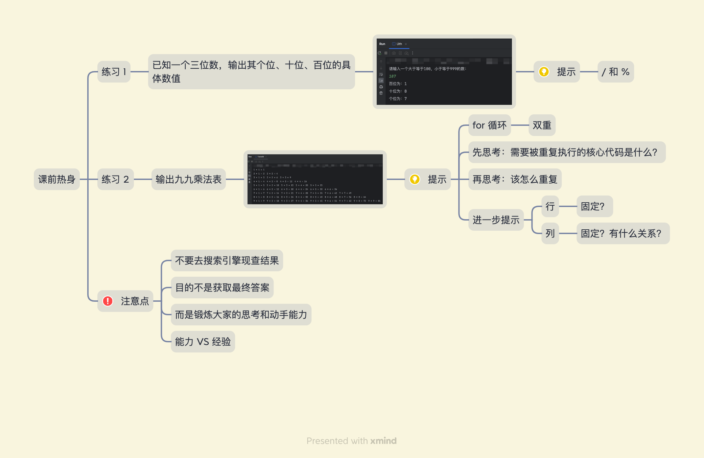
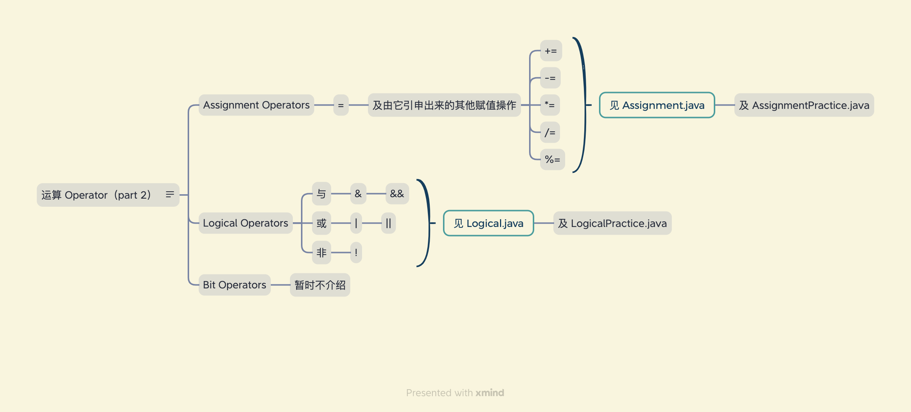
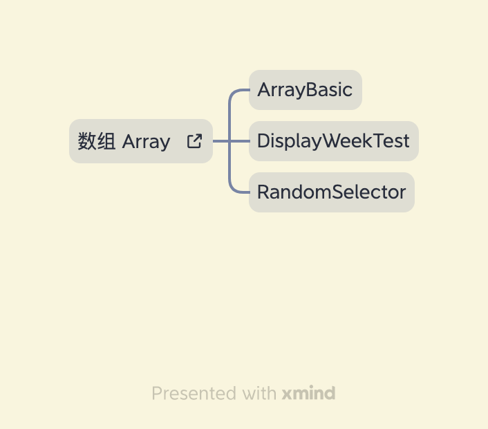

## 本节重点
- 写了一个随机点名的程序，被点到的同学，投屏演示自己的远程代码仓库
- 练习2: 输出九九乘法表
    - 代码不是一步就写好的
    - 要有分步实现的思路（重点）
- 数组的定义
    - [养成去源头找资料的习惯](https://docs.oracle.com/javase/tutorial/reflect/special/array.html)
    - 练习看官方文档，持续下去会有额外的收获
    - An array is an object of reference type which contains a fixed number of components of the same type;
    - the length of an array is immutable.
- 知识要为自己服务
    - 学完数组，就可以自己实现今天一开始真实用到的随机点名程序

## IDEA
- 配置
  避免每次打开 IDEA 都默认打开上次打开过的项目
  

- IntelliJ IDEA CE（Community Edition）

## 课前热身

## 运算 Operator（part 2）

## 数组
