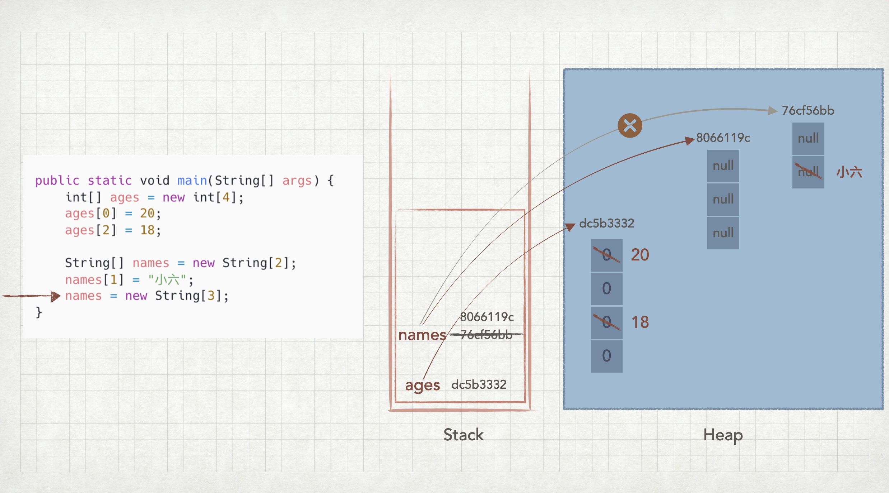
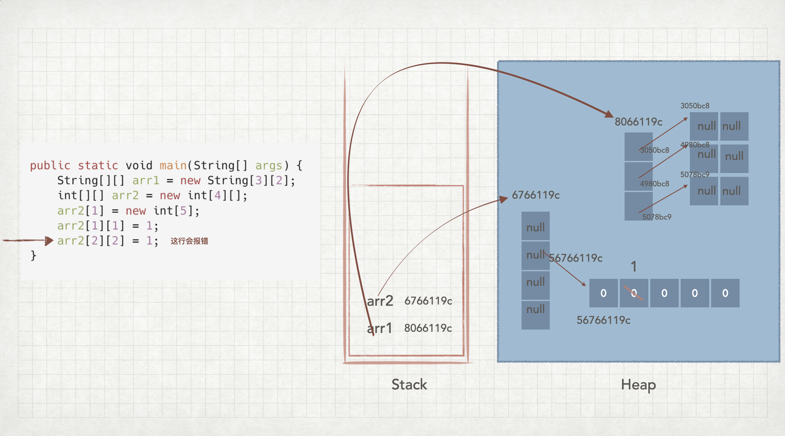

## 程序员招合租，隐藏在代码中的电话号码

## 细节中见「能力」
从今天的 `DisplayPhoneNumberTest.java` 到前一天的 `Table99.java`

特别是 `Table99.java` 的代码，每个人都应该能重写出来

到处都是细节、线索
- 项目名
- 包名
- 类名
- 变量名
- 代码中的注释
- git 中的 commit 消息
- ...

留下线索是为了降低自己以后的能量消耗，所以它值得花时间

## 数组的概念复习
数组介绍
[Arrays](https://docs.oracle.com/javase/tutorial/reflect/special/array.html)
- An array is an object of reference type which contains a fixed number of components of the same type;
- the length of an array is immutable.
- Creating an instance of an array requires knowledge of the length and component type.
- Each component may be a primitive type (such as byte, int, or double),
  a reference type (such as String, Object, or java.nio.CharBuffer),
  or an array.
- Multi-dimensional arrays are really just arrays which contain components of array type.

## 一维数组的内存解析

## 二维数组的内存解析
赋值理解：数组中的元素又是数组（重读官方文档的数组介绍）

## 数组中元素的默认值
基础数据的默认值
- 自己验证各种不同类型

引用数据类型的默认值
- 数组也是引用数据类型（看官方文档的数组介绍第一句 An array is ... reference type ...）
