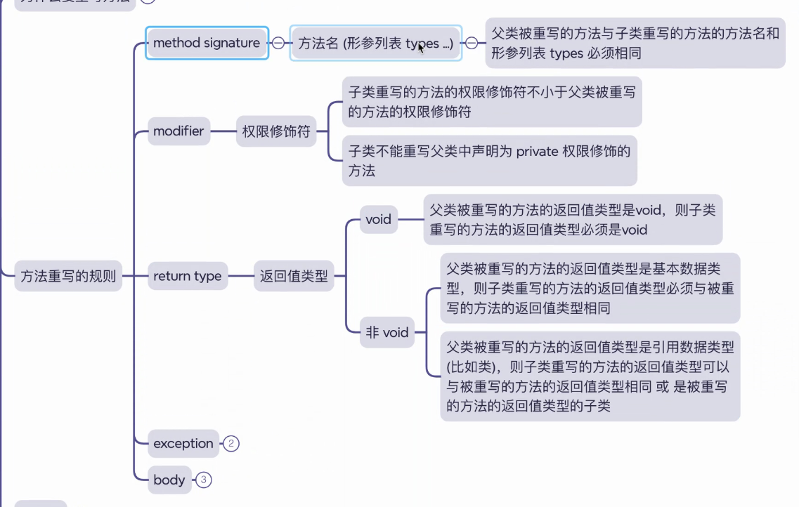
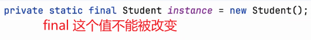
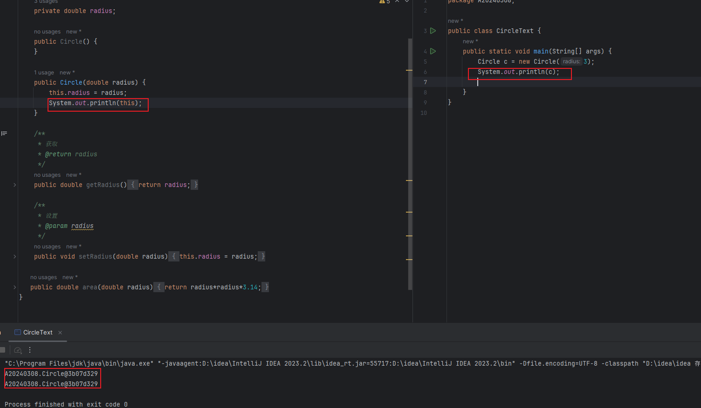
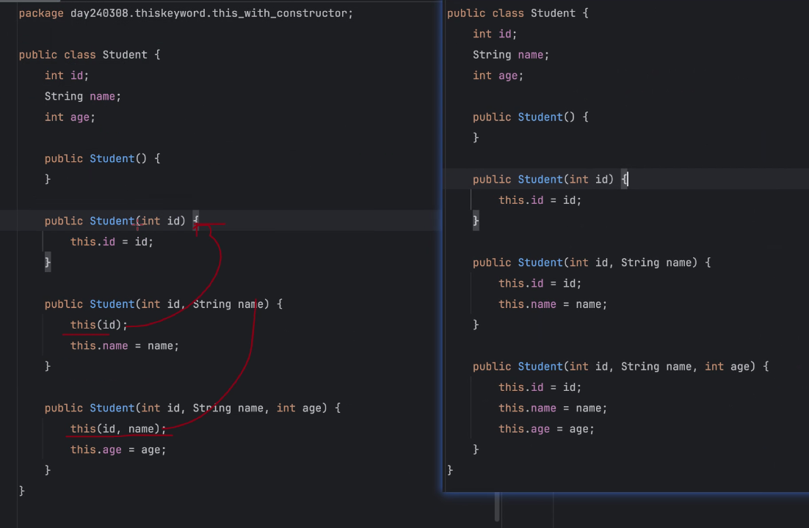
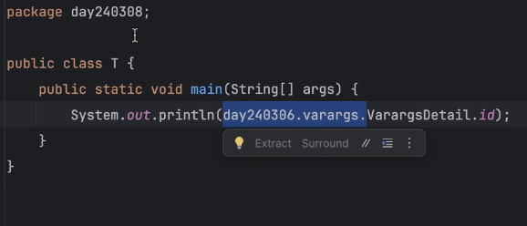
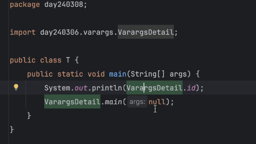
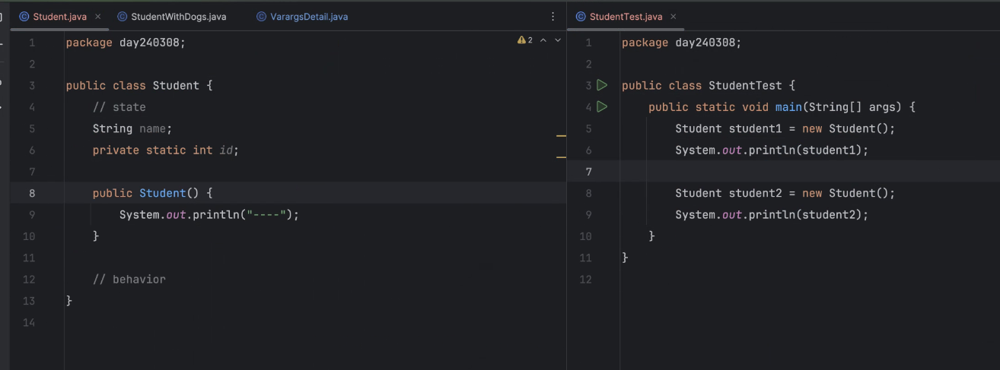

# 前言
## 昨日的题目

## 添加知识点

要从不同方式去考虑，有权衡

可变参数不能放置在首项
# 练习重置
将内容转为方法输出

说来惭愧，这个是我在一次错误中悟出来的：方法的正确完整的写法：类名.方法名();

## 方法名的书写要精确得当，以动词开头，驼峰命名

## 循环等价

该循环等价于循环 Student 方法下的 students 数组

## 面向对象细则

在一个方法中，他的this就代表将他 new 出来的这个内容的名字

在两行代码中 ， 由此可得 this 和 Circle 是同一个地址值的同一个东西

构造器多重可改进

## 不同包下的方法使用

或者

# 课后作业：单例实例运算

解题思路：
我的解读解题思路是因为这一个类中，一个构造器已经被封锁起来了

那么如果要new出来一个实例的话，肯定就不能放在构造器中，因为要先访问这个实例才能访问构造器，访问构造器，构造器都访问不了的话，就不能访问这个new

所以我们就得放在构造器之外，那么放在构造器之外，我们要想什么办法才能让它应用

我想到的办法就是使用方法

在这个类中构造一个方法方法返回值是s，s就是这一个类的地址

而这个地址是开放式的，能够返回这个地址的值，就是说它只能构建一次

一旦进入这个开辟之后，它这个new就一直存在着，只能访问一次

## 存在问题

如果在test中已经使用了一次测试方法，那么下一次方法应该会出栈 ， 出栈之后再使用方法，地址值应该不会相同，或者说地址值为什么会相同？

### 解决问题
