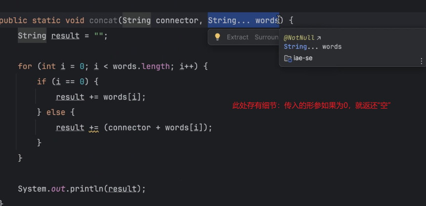
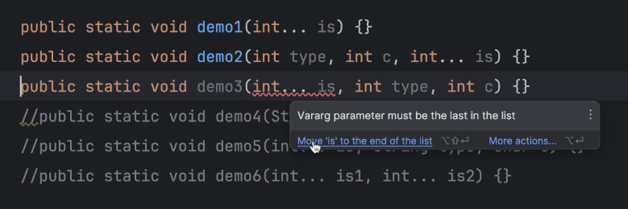

# 前言
## 昨日的题目

## 添加知识点

要从不同方式去考虑，有权衡

可变参数不能放置在首项
# 练习重置
将内容转为方法输出

说来惭愧，这个是我在一次错误中悟出来的：方法的正确完整的写法：类名.方法名();

## 方法名的书写要精确得当，以动词开头，驼峰命名

## 循环等价

该循环等价于循环 Student 方法下的 students 数组

## 面向对象细则

在一个方法中，他的this就代表将他 new 出来的这个内容的名字

在两行代码中 ， 由此可得 this 和 Circle 是同一个地址值的同一个东西