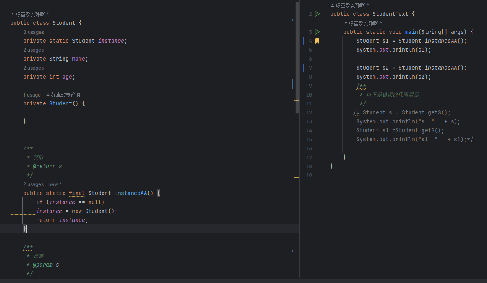
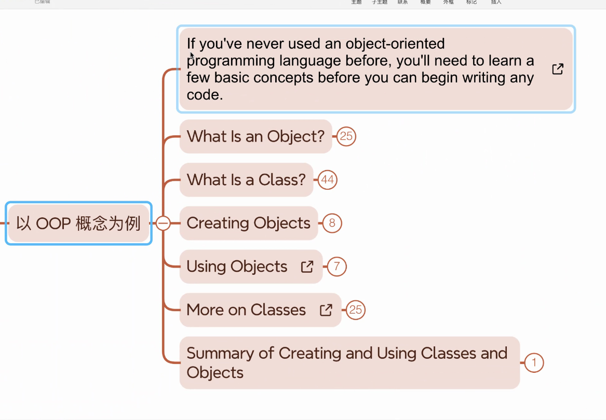
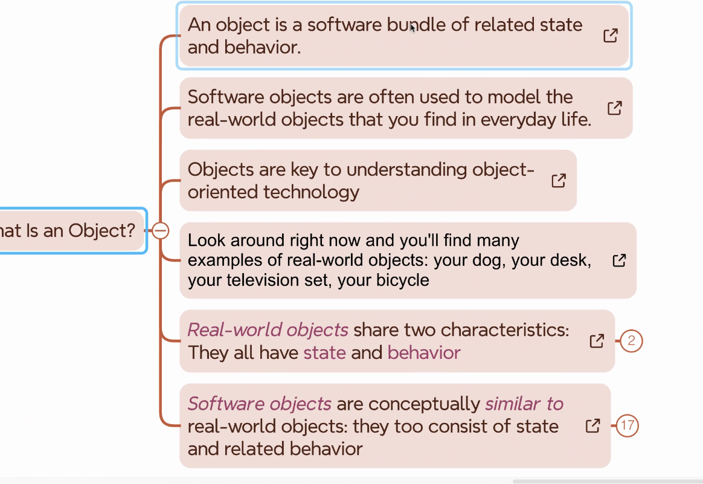
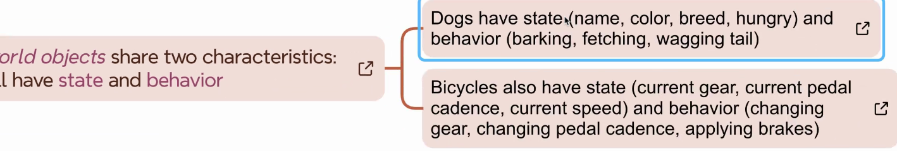

# 昨日的练习

static 属于方法的一部分，不需要 new 就可以访问，相当于创立了一个方法，方法内容就是 new 出一个对象便于使用

## 注意

在这次的练习中，存在有错误，有关于出栈入栈的错误项

相关说明移步 -> [Readme.md](..%2FA20240308%2FReadme.md)

### 新增

因为 instance 这个会被赋值为 NULL

#### 解决方法

使用 behavior get 和 set 方法来使用

引入 final 这个值 ， 代表不能被改变

初始化一次之后就不能被改变

## 单一实例不止可以使用 state 还可以运用 behavior

# 访问权限修饰符

由图可得

# 文档带读

