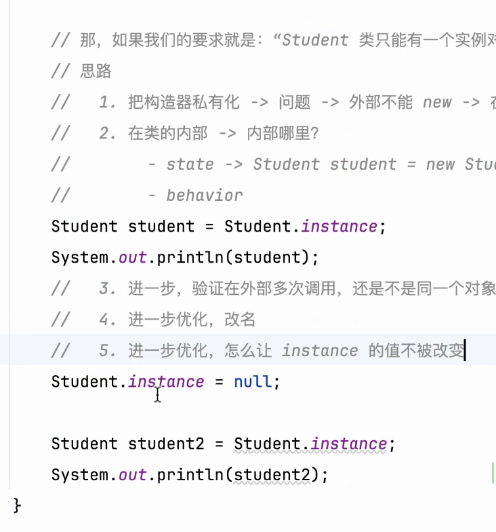

# 昨日的练习

static 属于方法的一部分，不需要 new 就可以访问，相当于创立了一个方法，方法内容就是 new 出一个对象便于使用

## 注意

在这次的练习中，存在有错误，有关于出栈入栈的错误项

相关说明移步 -> [Readme.md](..%2FA20240308%2FReadme.md)

### 新增

因为 instance 这个会被赋值为 NULL

#### 解决方法

使用 behavior get 和 set 方法来使用

