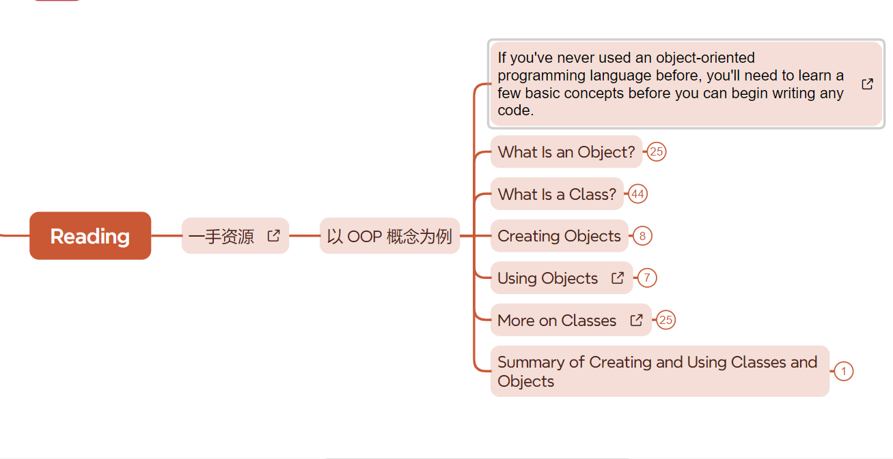
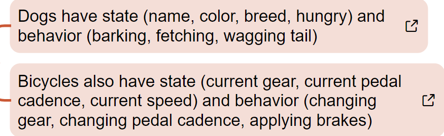
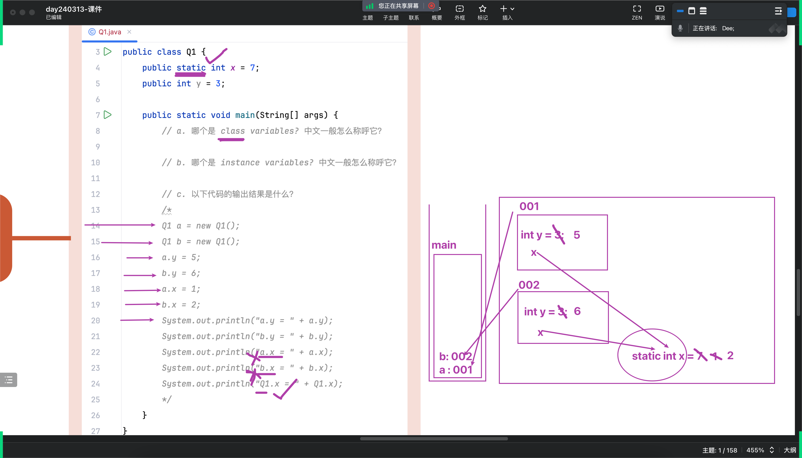

# 读文档，总结

## 面向对象

关于面向对象的基础概念知识

面向对象包括于 state 状态 和 behavior 行为 ， 现实世界中的对象就于面向对象相近，几乎所有现实世界的对象都能被 “编写” 成面向对象语言。

要学习面向对象语言就必须掌握 state 和 behavior 

现实世界中的物品、生物也存在着这两种资源，以下例子

### state

在命名 状态 这一字段时，通常采取 “见名知意” 的命名方法  字段所使用的数据类型为很多，分为引用数据类型和基础数据类型，这两类均可使用。

在字段声明时 ， 可以对其有初始化值 ， 如果不对其进行初始化赋值 ， Java会自动帮它赋值 ， 比如 int -- 0 ， String -- null。

### behavior

行为就是在类中创建方法对其进行使用，便是进行这一个行为

在 state 被 private 后 ， 可以通过方法进行访问，提高了代码的安全性

## 类

类便是存储面向对象的内容的容器，类的内部包含了

# static

state属于 class    级别

static 的变量 总是指向同一个地址值

# 习题

static 是 静态方法，引用于该类的所有 static 元素都指向同一个地址值

