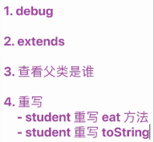

# Questions

 Real-word object contain state and behavior

A software object's state is stored in fields

A software object's behavior is exposed through methods

Hiding internal data from the outside word , and accessing it only through publicly exposed methods is known as date encapsulation

A blueprint for a software object is called a class

# 杂项

调试到红点位置

# 对象

不建议再继续使用

# 111

# 洗牌为什么会错误？

因为此处调用对象属于每循环一次就调用一次，所以会错误

