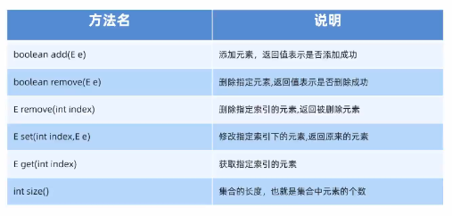
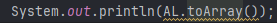
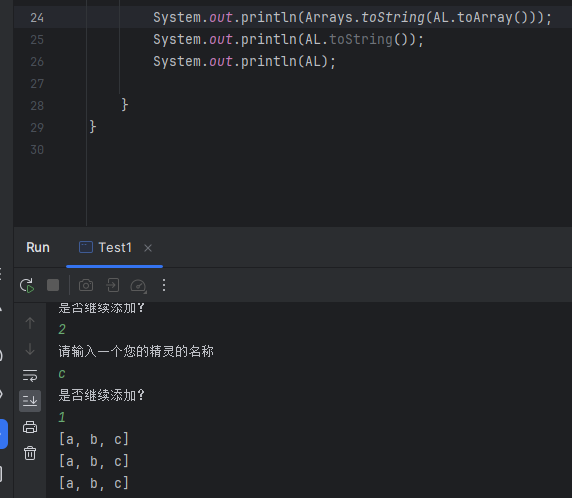

# 关于集合

## 集合与数组的区别

集合与数组的区别为，数组固定长度，集合不固定，数组能存所有的类型，集合只能存储引用数据类型

## 如何使用

如图所示，集合有增删改查这几个基本使用方式

# 集合练习 1

### 注意

toArray() 方法是用于转化为数组

# 集合练习 2

## 基本数据类型对应的包装类

由于 ArrayList 不能直接存储基本数据类型，所以我们将他变为包装类来使用

