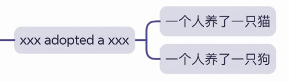
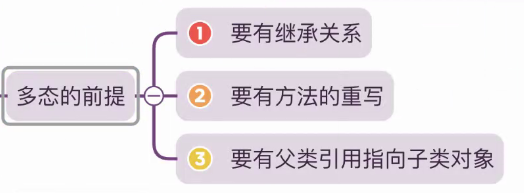
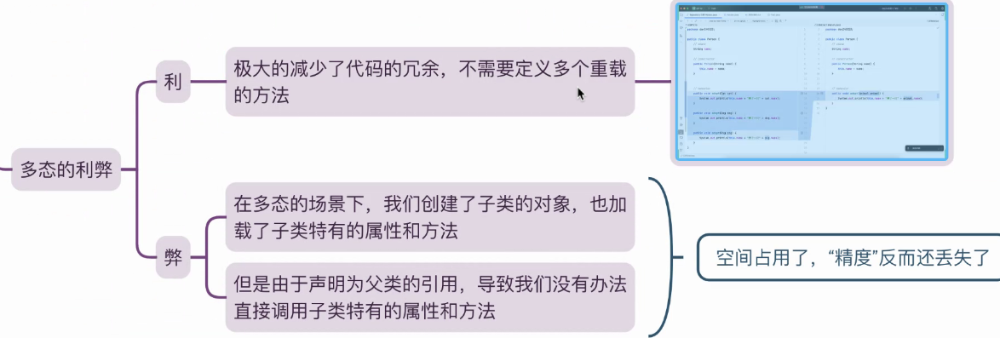

# 课前训练

## 代码实现

[CultivationPerson.java](CultivationPerson.java)

## 如果是一个人可以养猫也可以养狗

方法的实现是设置一个类专门放置宠物，另一个类是专门用作养殖 ， 宠物是父类， 子类是养殖

## 老师解答

按照老师的运用过程可以知道，如果先创建一个类来存储，就可以更加方便，还保留了每个动物的特性

### 注解 - 小猫就是OOAD练习

# 多态

## 多态的前提

## 多态的适用性

## 多态的利弊

## 多态

[README.md](..%2FB20240323%2FREADME.md)

# 描绘“孤独”
