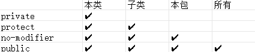

# 面向过程 和 面向对象 

# OOP

面向对象和面向过程之间关系紧密

In OOP ,we create objects to solve complex problems.

## What`s an Object 

关键词： software bundle 、 related state , behavier

## What`s a Class

### 如何定义一个 Class?

#### Modifier：public , protect , private , no-modifier

#### Class-name

##### 命名规则

1、见名知意

2、大小驼峰命名法

#### Class-body

# ====================

# Class - body

## state (field , variable)

修饰符 (static  final) 变量类型 变量名 = 变量值；

### 基础数据类型

#### 四类八种

整型 ： byte , short int ,long

浮点数: float , double

字符 ： char

布尔: boolean

### 引用数据类型

String ,数组 ,Scanner ,Random ,自己创建的类

## behavier (method , function)

###  包含

修饰符 (static , final) 返回值类型 方法名 (参数列表){ method-body }

#### 方法的重载

重载是在同一个包内变量名不同名 、 方法签名

#### 方法的重写

重写要求

1、在子类中重写

2、方法签名全部相同

## constructor

如果没写，会自动生成空参
