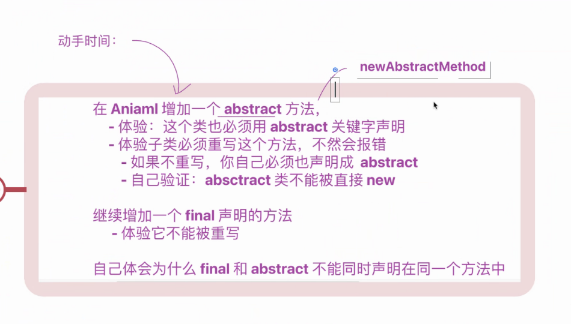
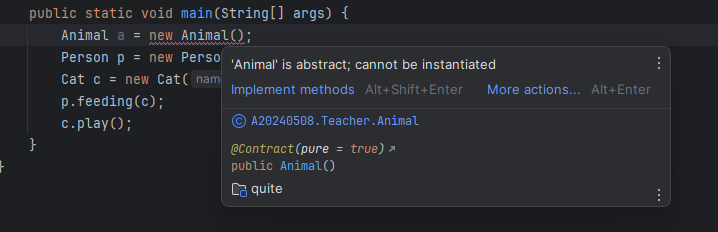
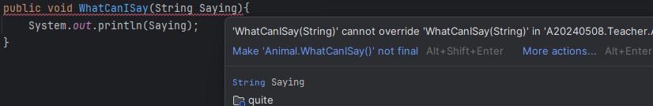

# 回顾先前代码，代码来自 [A20240324](..%2FA20240324) 包

# 体验

## 在 Aniaml 中添加一个抽象方法

### 在增加抽象方法后需要将这个类变为抽象类

### 所有的子类都需要重写这个 abstract 方法

## 验证 abstract 类不能被 new

abstract 类不能被 new

## 添加一个 final 声明的方法 验证它不能被重写

被 final 修饰的方法不能被重写

