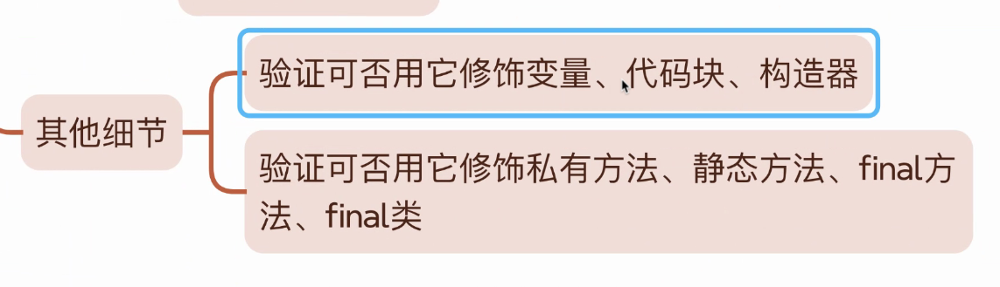

# 引出匿名类

# 

验证 abstract 是否可以修饰以上

# final 对于变量中在不同位置的效果

## Instance Variable 

### 局部中

无法进行更改（从代码逻辑上无法更改）

### 同级中

无法进行更改(从底层意义上无法更改)

## Class Variable

无法进行更改（从代码层面上无法更改）

## Local Variable

无法进行更改（从代码层面上无法更改）
