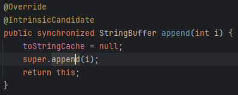
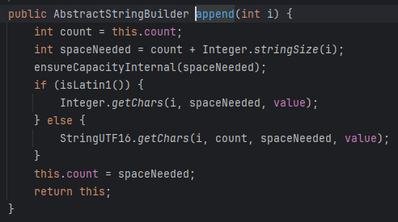
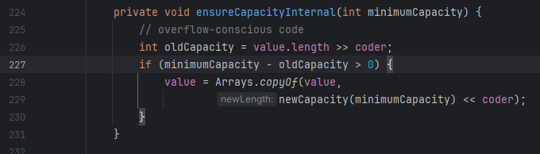

# 为什么 StringBuffer 的 append 能无限调用？

通过阅读源码，我们能够知道

## 为什么它占用内存会那么小

在 StringBuffer 中，toStringCache 是用于返回拼接完成的字符串的，相当于这个字符串在堆内部的缓存

toString 返回的最后一个值的缓存。每当修改 StringBuffer 时都会清除。

## super.append();

调用了父类的方法

* #827： 获取原有的字符串的长度
* #828： 获取增加新字符后字符串的长度
### 调用了 Integer.stringSize(i); : 返回 i 的长度
* #829： 
### 调用 ensureCapacityInternal();  : 如果新字符串长度大于旧字符串，那么就会使得 value 变为新数组

* #830~over ： 获取字符串并加入新容器中
