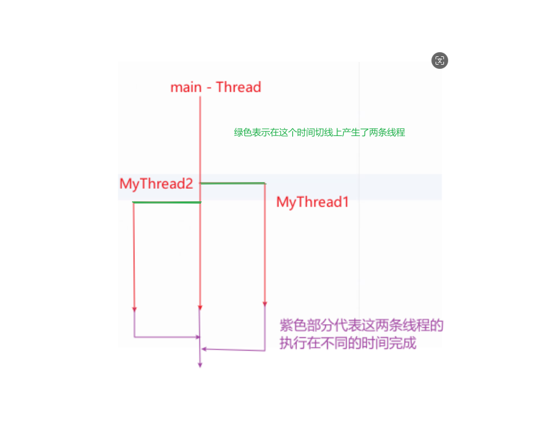

## 线程和进程

### 基本资料
* https://www.ruanyifeng.com/blog/2013/04/processes_and_threads.html
* https://docs.oracle.com/javase/tutorial/essential/concurrency/procthread.html

## 继承并使用 Thread 类，使用它的 run() 方法和 start() 方法
[ThreadTest1.java](..%2FThreadTest1.java)

## Thread 的静态方法

### sleep

让程序在这里睡眠，睡眠时间就是形参输入的时间（毫秒值）

### yield

将目前处理的线程暂停，让别人先行

### setPriority

设置优先级，但是 Java 并不能完全控制

### isAlive

判断当前的线程是否在运行