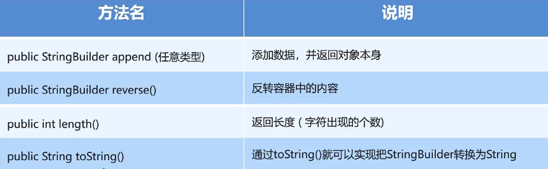

# StringBuilder

[StringBuilder1.java](StringBuilder1.java)

append() , 把括号内的内容添加进入这个模具内

reverse() ,  反转字符串

length() ,  输出这个模具内的字符长度

toString() ,  把模具内的元素变为字符串类型

# StringJoiner

add(), 把括号内的内容添加进入这个模具内

toString() ,  把模具内的元素变为字符串类型(包括分隔和括号)

## 注意事项

这个类在创建时必须至少要输入一个参数

StringJoiner sj = new StringJoiner(",","[","]");

循序为：左边的是分隔每两个字符 ， 中间的是开头 ， 末尾的是结束

