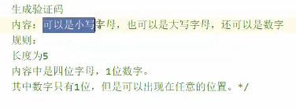
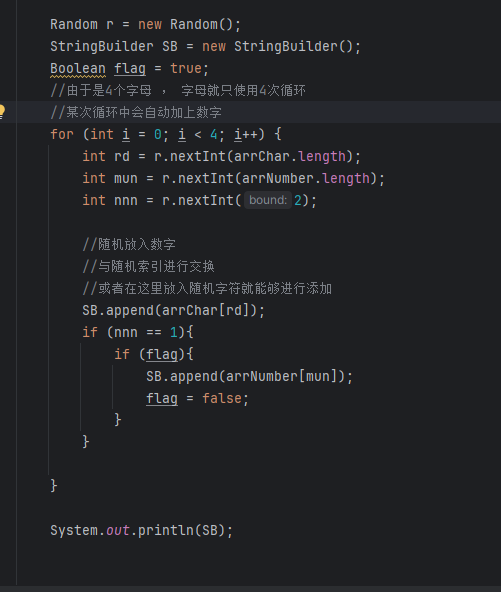
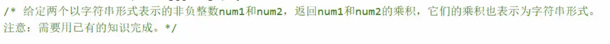
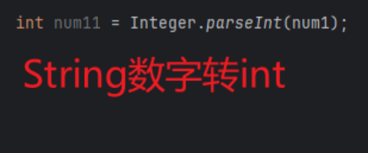
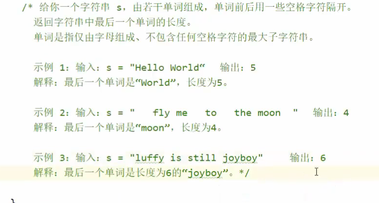

# 生成验证码

## 创建一个字符数组

想办法放入 26 个大写 和 小写 字母

### 方法一：

直接打--------------------太麻烦

而且并没有加入我们的要求，代码的实现就是走向便捷化的，有什么方式能够更便捷呢？

### 方法二：

使用 ASCLL 码表

联系一下，不难想到，ASCLL 码表 对于英语字母之间放置在一个部位，只需要获取编码值就能够反向推出字母表

## 随机数放入容器输出

# 字符数相乘

## 方法一：强转相乘法

无法完成 ， String 无法强转为 int

## 方法二：使用Inteder.parseInt方法

# 返回最后单词

## 解决方法

反向遍历寻找字符 ‘ ’ 如果寻找到了 就返回索引，用当前索引去获取
