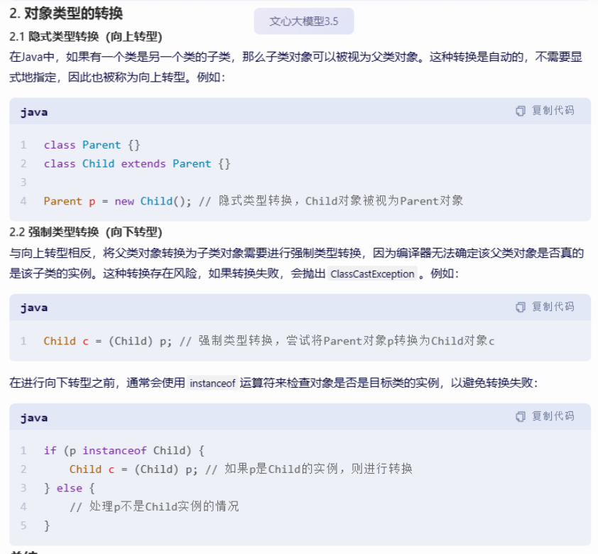

# 对象类型的强制转换

## 隐式转换

注意 ， 在这个转化中，倘若子类中拥有父类没有的方法 ， 那么会被变为不再可见。

### 例如

[Test1.java](Test1.java)

在该代码内 ， 尽管p实际上是指向一个Child对象，但在通过p调用方法时，我们只能访问Parent类中定义的方法。如果尝试调用childMethod()，编译器会报错，因为p被视为Parent类型，而Parent类没有定义childMethod()。

