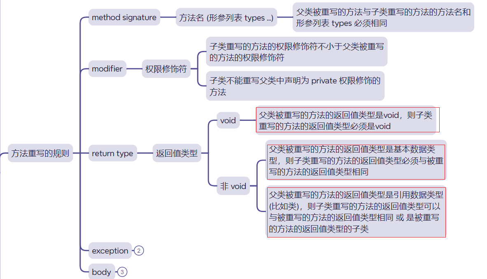
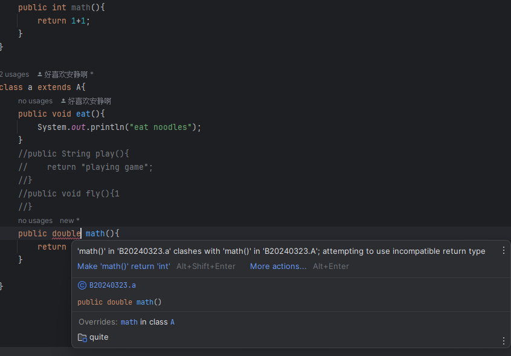
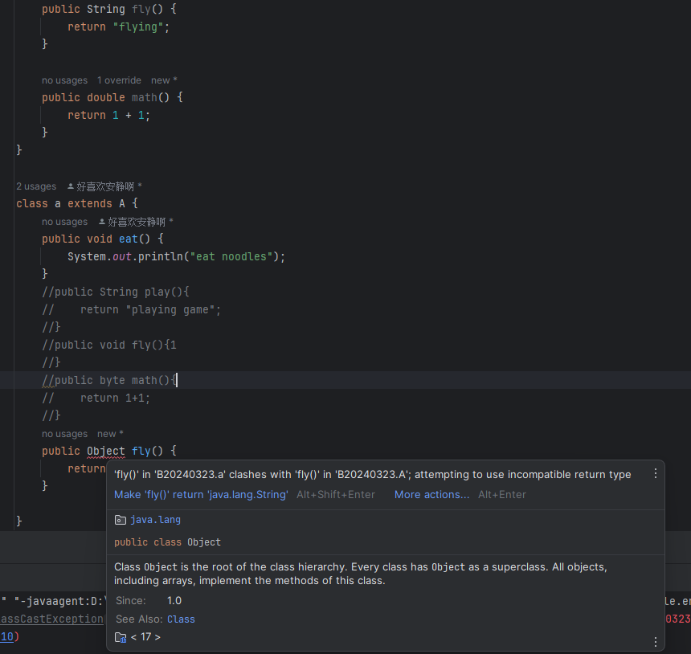

# 对象类型的强制转换

## 隐式转换

注意 ， 在这个转化中，倘若子类中拥有父类没有的方法 ， 那么会被变为不再可见。

### 例如

[Test1.java](Test1.java)

在该代码内 ， 尽管p实际上是指向一个Child对象，但在通过p调用方法时，我们只能访问Parent类中定义的方法。如果尝试调用childMethod()，编译器会报错，因为p被视为Parent类型，而Parent类没有定义childMethod()。

## 强制转换

强制转换要判断两类之间是否为父类与子类的关系

使用 instanceof 运算符判断

[Test2.java](Test2.java)

由代码可以知道，强制转换 ， 就算是父类强转为子类 ， 代码虽然不会报错，但是还是不被允许的

更何况是将非父子类关系的对象进行强转，

此外，可以使用 instanceof 判断这个变量是否属于这个类（或者属于这个类的子类）

# 关于方法的重写

## 返回值

[Test3.java](Test3.java)

如果要重写情况下，父类为void返回值，而子类拥有一个返回值就会报错

同理，若子类的返回值为 void 而父类的返回值存在情况下，也会报错

在重写不同基本数据类型的方法中 ， 不允许 返回值不相同

在这种情况下，如果使用父类重写子类无法成效 ， 但是如果使用子类去重写父类就可以被使用

## 权限修饰符

### 如果父类为  private 修饰符

重写的修饰符为private时没有报错

可能是因为 ， 子类直接将这个作为同名的方法（实际上两个方法之间并不存在重写关系）他们两个是相对独立的方法

### 其他修饰符

其他的修饰符重写时不允许 子类重写出的方法修饰符的权限小于父类修饰符权限

