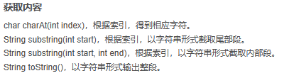

# 关于 StringBuffer

## StringBuffer 其实和 StringBuilder 是一样的，继承于同一个抽象类，所以他们拥有的方法都是相同的

### StringBuffer 的方法

[AboutStringBuffer.java](AboutStringBuffer.java)

#### 添加

#### 反转

#### 替换

#### 删减

#### 插入

#### 长度，大小

#### 获取内容

#### 输入索引，返回对应值

