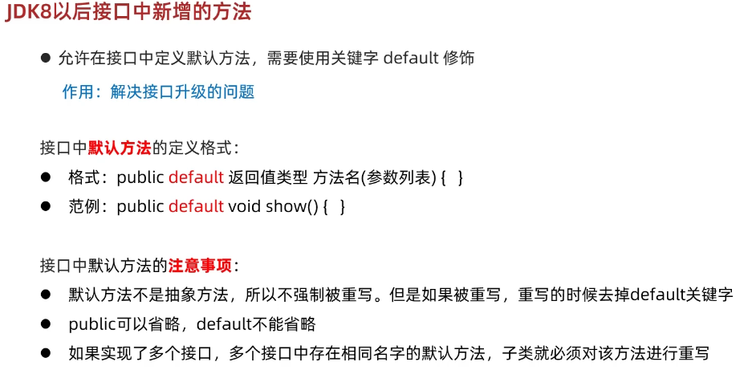
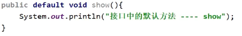
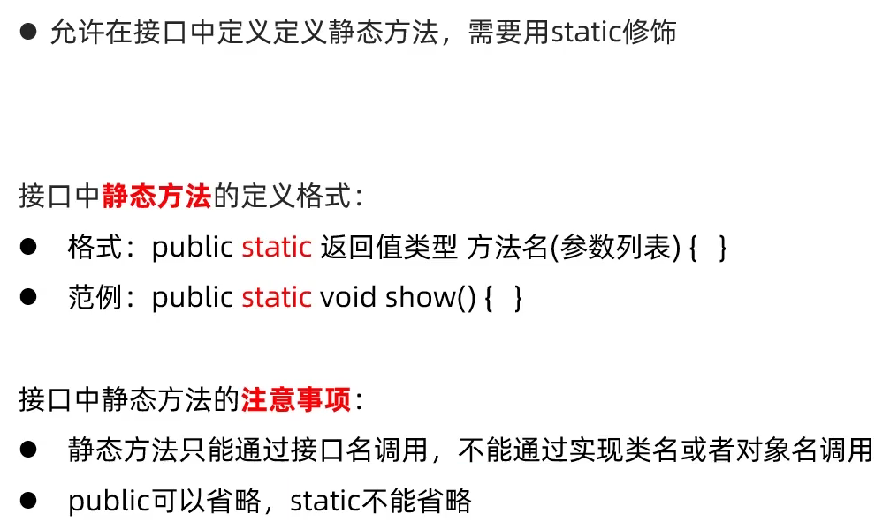
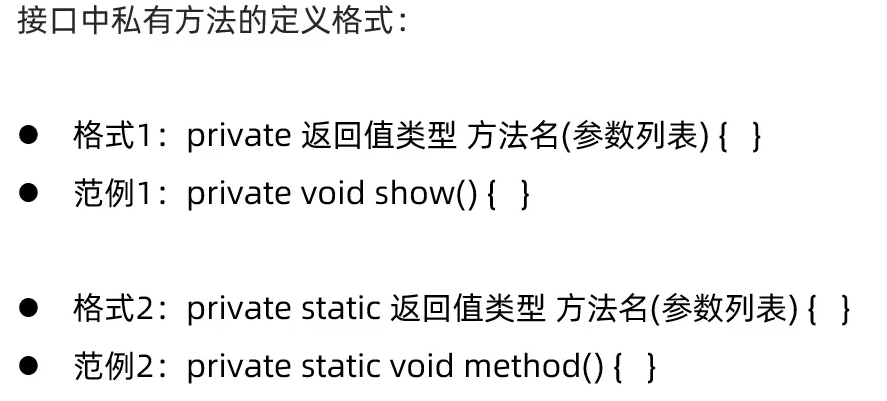
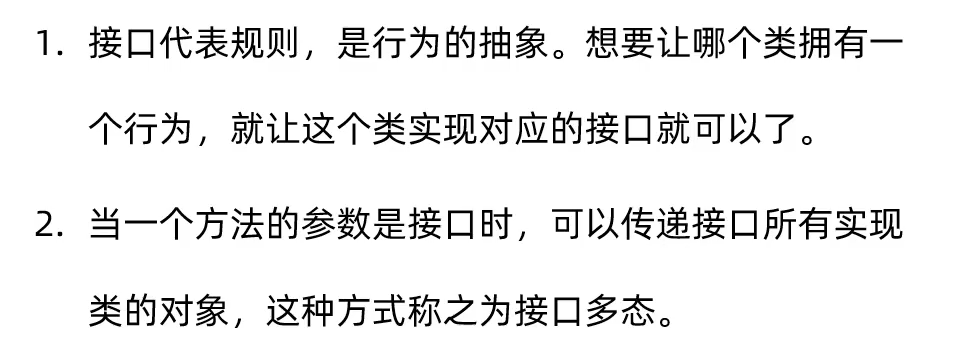
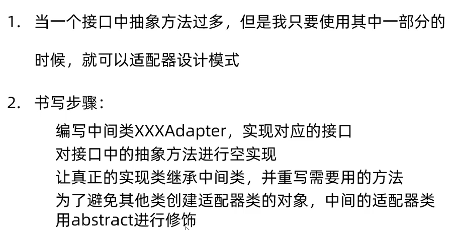

# 关于接口的进阶技巧（接口升级）

在某些时刻，代码更新后，父类的接口必须要子类继承，那么就会产生子类的错误，如果在子类没有及时做出更正就会导致代码程序错误

## 解决方法

### default

使它有自己默认的方法，要重写的话再重写就行了

如果调用多个接口，接口中有相同的方法名的 default 方法，则必须要重写

### static

只能通过  接口名.方法名调用

### private  && private static

不想让外界调用的话就 使用私有化修饰符
为默认方法服务的

如果默认方法是静态方法就加上 static 关键字 、 静态私有化是为了静态默认方法服务的

# 接口的多态

[AAA](AAA)

# 接口的适配器模型

创建一个 抽象类 空实现 接口的所有方法，然后再继承实现接口的类，这样子可以使得接口中不想被使用的方法得到放置，使得代码阅读更改舒适

