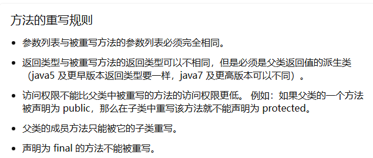
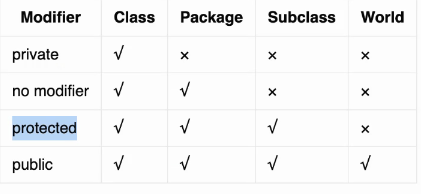

# Test0 : 如果一个类没有声明构造方法，该程序能正确执行吗？构造方法是否可被override？

## 如果一个类没有声明构造方法，那么Java虚拟机在进行编译的时候就会自动添加一个空参构造

## 构造方法不可以被重写

# Test1 ： Java 的重写（Override）和重载（Overload）有什么区别？

## 重写 ：要求有两个拥有继承关系的类，并且满足子类重写父类，即是子类重写一个 返回值、方法名 、 形参，但是方法体可以不同



## 重载 ： 重载是在同一个类中的相同方法名，不同方法签名的两个方法叫做重载

# Test2 ： 分别写出形参和实参的单词？

## 实参 ： Parameters

## 形参 ： Arguments

# Test3 ： 4.Java中的基本数据类型一定储存在栈中吗？为什么？

## 不一定，比如在面向对象中的基本数据类型存储在堆内存中，由栈中的地址值去点它调用

# Test4 ： 访问权限修饰符 public，private，protected，以及不写（默认）时的区别？

## 

# Test5 : 什么是Java 虚拟机？

## （Java Virtual Machine，JVM）是Java平台的核心组成部分之一，它是一个在计算机上运行Java字节码的虚拟机。JVM充当了Java应用程序和底层操作系统之间的中间层，提供了跨平台的特性，使得Java程序可以在不同的操作系统和硬件上运行。

# Test6 : 题目：编写一个Java程序，实现对一个整数数组进行冒泡排序，并输出排序后的结果。（填空题）

````
public class BubbleSort {
public static void main(String[] args) {
int[] arr = {64, 34, 25, 12, 22, 11, 90};

            System.out.println("原始数组：");
            printArray(arr);

            bubbleSort(arr);

            System.out.println("\n排序后的数组：");
            printArray(arr);
        }

        // 冒泡排序算法
        static void bubbleSort(int[] arr) {

            请填写空缺的代码

        }

        // 输出数组元素
        static void printArray(int[] arr) {
            请填写空缺代码
        }
    }
````

## 回答

````
public class BubbleSort {
public static void main(String[] args) {
int[] arr = {64, 34, 25, 12, 22, 11, 90};

            System.out.println("原始数组：");
            printArray(arr);

            bubbleSort(arr);

            System.out.println("\n排序后的数组：");
            printArray(arr);
        }

        // 冒泡排序算法
        static void bubbleSort(int[] arr) {

             for (int i = 0; i < arr.length; i++) {
                for (int j = 0; j < arr.length - i - 1; j++) {
                    if (arr[j] > arr[j+1]){
                        int li = arr[j];
                        arr[j] = arr[j+1];
                        arr[j+1] = li;
                    }
                }
            }

        }

        // 输出数组元素
        static void printArray(int[] arr) {
             for (int i = 0; i < arr.length; i++) {
                System.out.println(arr[i]);
            }
        }
    }
````

# Test7 : 官网对oop的解释

## OOP代表面向对象编程。过程编程是关于编写对数据执行操作的过程或函数，而面向对象编程是创建同时包含数据和函数的对象。

# Test8 :  抽象类必须要有抽象方法吗

## 抽象类不一定要有抽象方法，抽象方法必须在抽象类中

<hr>

# Test0 :

# Test1 :

# Test2 :

# Test3 :

# Test4 :

# Test5 :

# Test6 :

# Test7 :

# Test8 :

# Test9 :

# Test10 : 
