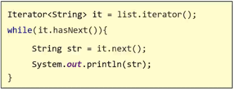

# 集合体系结构：单列集合

## Collection

>

* 遍历方式

> 遍历的方式 -- 迭代器
>
>> 
>
> 迭代器不需要索引就可以遍历所有的元素
>
>> 迭代器的使用方式：
>>
>> 先将元素变为 Iterator 对象 再使用内部的方法 "hasNext" 与 "next" 来遍历整个集合
>
> 迭代器总结
>
> 
>

### List

* 添加元素的特点

添加的元素是有序的、可重复、拥有索引

#### Arraylist

#### LinkedList

#### Vector

### Set

* 添加元素的特点

添加的元素是无序的、不可重复、没有索引

#### HashSet

##### LinkedHashSet

#### TreeSet