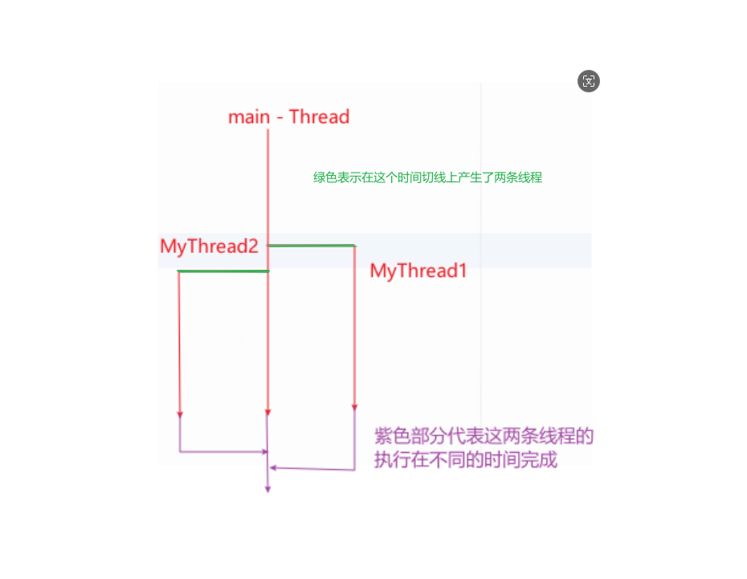

## 线程和进程

### 基本资料
* https://www.ruanyifeng.com/blog/2013/04/processes_and_threads.html
* https://docs.oracle.com/javase/tutorial/essential/concurrency/procthread.html

## 继承并使用 Thread 类，使用它的 run() 方法和 start() 方法
[ThreadTest1.java](..%2FThreadTest1.java)
