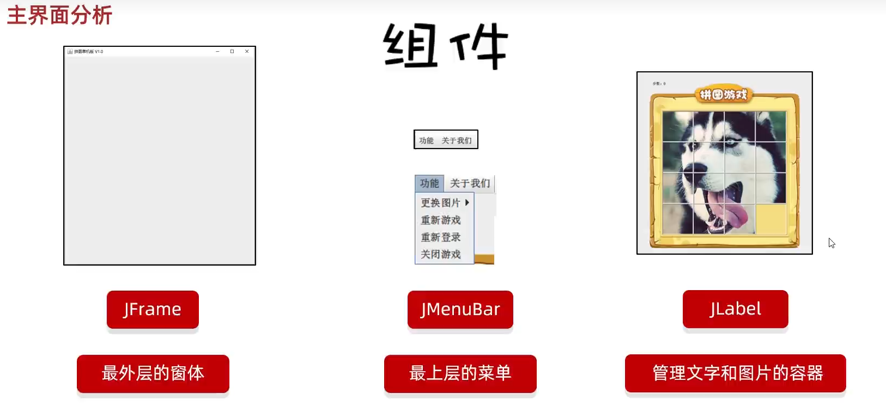
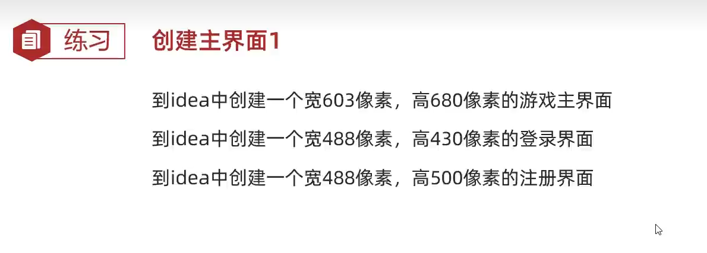
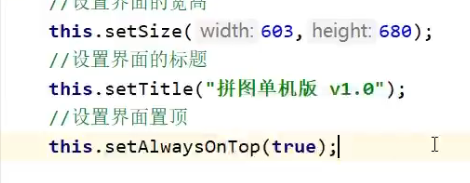
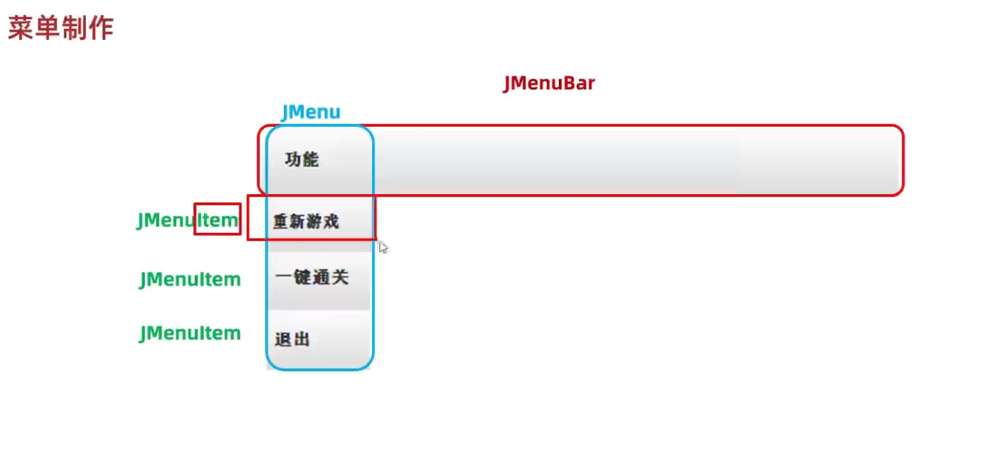

# 拼图游戏

## 组件

### 创建 JFrame

#### JFrame

##### setSize(width , height)

设置这个界面的宽和高

##### setVisible(true/false)

设置界面是否显示，true 是显示界面 ， false 是隐藏界面

        this.setAlwaysOnTop(true);//是否置顶（是）

